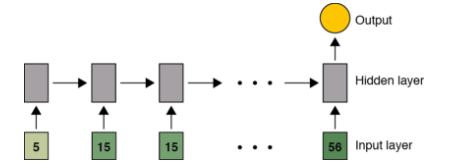
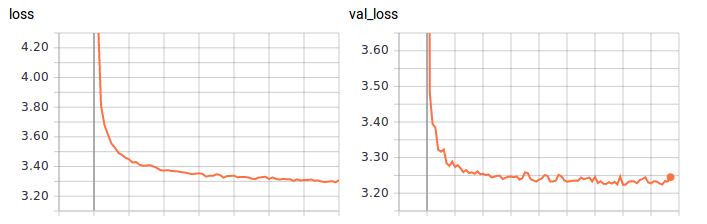
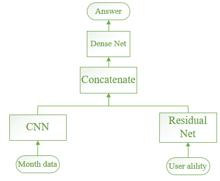

# JDD2017数据开发竞赛

## 主要思路为

	1、按照传统的特征工程->调参->模型融合
	2、利用seq2seq时序模型，提取特征，免去时序特征分析的工作。
    3、利用CNN的思路，reshape(samples, 4, features,1)

## 1、传统思路
### 特征工程

	（1）Data Exploration

在这一步要做的基本就是 EDA (Exploratory Data Analysis)，也就是对数据进行探索性的分析，从而为之后的处理和建模提供必要的结论。
用 pandas 来载入数据，并做一些简单的可视化来理解数据.

	（2）Visualization
通常来说 matplotlib 和 seaborn 提供的绘图功能就可以满足需求了。

比较常用的图表有：

查看目标变量的分布。当分布不平衡时，根据评分标准和具体模型的使用不同，可能会严重影响性能。

对 Numerical Variable，可以用 Box Plot 来直观地查看它的分布。

对于坐标类数据，可以用 Scatter Plot 来查看它们的分布趋势和是否有离群点的存在。

对于分类问题，将数据根据 Label 的不同着不同的颜色绘制出来，这对 Feature 的构造很有帮助。

绘制变量之间两两的分布和相关度图表。

    目前对于时序数据的处理采用了package的方式，将8-10月和9-11月的数据进行sum()，然后构造
    "loan_price_sum/plannum=repayment_ability",
    "loan_price_sum/loan_count_sum=loan_ability",
    "order_price_sum/order_count_sum=order_ability",
    "click_count_sum/4=activity_ability"
    "loan_price_sum/order_price_sum"=consumer_model
    "loan_count_sum/order_count_sum"=click_model
    作为新的属性值。
   特征工程有待进一步丰富,主要从data time feature, lagging feature, window feature,这里仅仅考虑了window feature。也可以尝试利用聚类等无监督学习的方式学习特征。最高得分上限为：1.85，应该是特征工程做得不够充分，没有对时序特征进行加工。

### 调参

	偷懒利用了TPOT进行调参，得出单模型还是使用XGBoost又快又好。

### 模型融合
	利用RF/ET/GBM/XGB作为Base Model，XGB作为第二层

## 2、seqseq思路
利用seq2seq model with attention(LSTM as kernel)
input:month data8\9\10 ->->-> output:month data 11
input:month data9\10\11 ->->-> output:month data 12
    
    1) Define the problem at hand and the data you will be training on; collect this data or
	annotate it with labels if need be.
    2) Choose how you will measure success on your problem. Which metrics will you be
    monitoring on your validation data?
    3) Determine your evaluation protocol: hold-out validation? K-fold validation? Which
    portion of the data should you use for validation?
    4) Develop a first model that does better than a basic baseline: a model that has
    "statistical power".
    5) Develop a model that overfits.
    6) Regularize your model and tune its hyperparameters, based on performance on the
    validation data

   
   

    在训练的时候，很容易发生过拟合，也就是training loss减少，但是validation_loss增大。解决思路为：
    1）Add dropout.
    2）Try different architectures, add or remove layers.
    3）Add L1 / L2 regularization.
    4）Try different hyperparameters (such as the number of units per layer, the learning rate of
    the optimizer) to find the optimal configuration.
    5）Optionally iterate on feature engineering: add new features, remove features that do not
    seem to be informative.

## 3、CNN的思路
	利用8、9、10月的数据进行折叠，reshape(samples, 4, features,1)，然后参照图像的方式，利用Conv2D（3，3），Maxpooling...
    在试验中，发现容易过拟合。
    Tuning之后，得到Score：1.847

## 4、利用Multi-input model
	下图所示：利用CNN进行month data的特征提取，然后利用Dense NN进行sum data的特征提取，得到 A 榜 Best Score：1.845， B 榜:1.826
   

## 总结
	
   收获颇多。把以前熟悉的各种深度的、非深度的模型都尝试了一遍。其实，还是特征很重要，特征提的好，简单模型也能有很好的表现。不太熟悉金融业务，所以对于信贷数据的特征没有把握很好，这限制了模型表现的上界。
